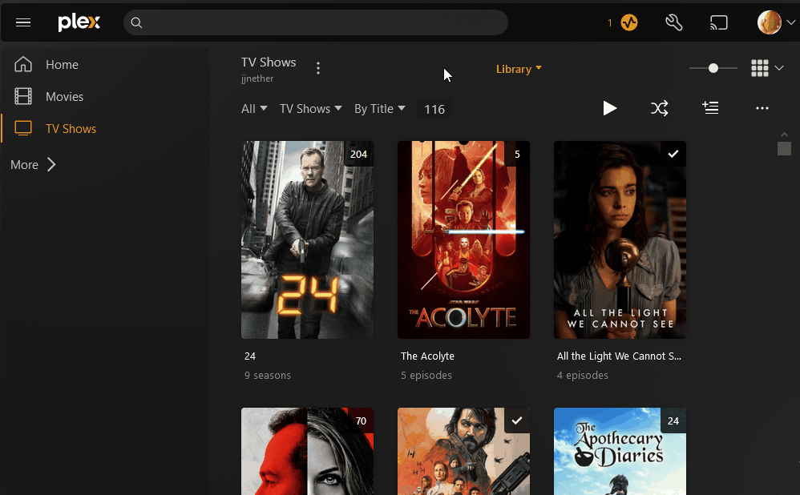
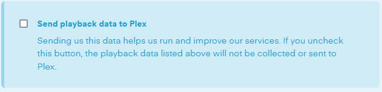

# User Guide for jjnether's Server

The following guide is to help new and existing users have an optimal experience with Plex on this server.

  > [!NOTE]
  > Nothing in this guide is absolutely necessary, but I still recommend you follow it for a better experience.

## Account Setup

You should already have a Plex account setup, but this section will walk you through modifying certain account settings:

- Plex rolled out a feature called [Discover Together](https://forums.plex.tv/t/discover-together-public-release/857227) that I prefer to disable.
  You can do this by navigating to the `Account` menu in your settings and editing settings:
 
  

- Opt out from sending playback data to Plex by going [here](https://www.plex.tv/about/privacy-legal/privacy-preferences/#opd) and deselecting
  `Send playback data to Plex`:

  

- Hide other users' activity as well as paid Plex content from displaying by navigating to the `Online Media Sources` menu in your settings and disabling all options:

  
