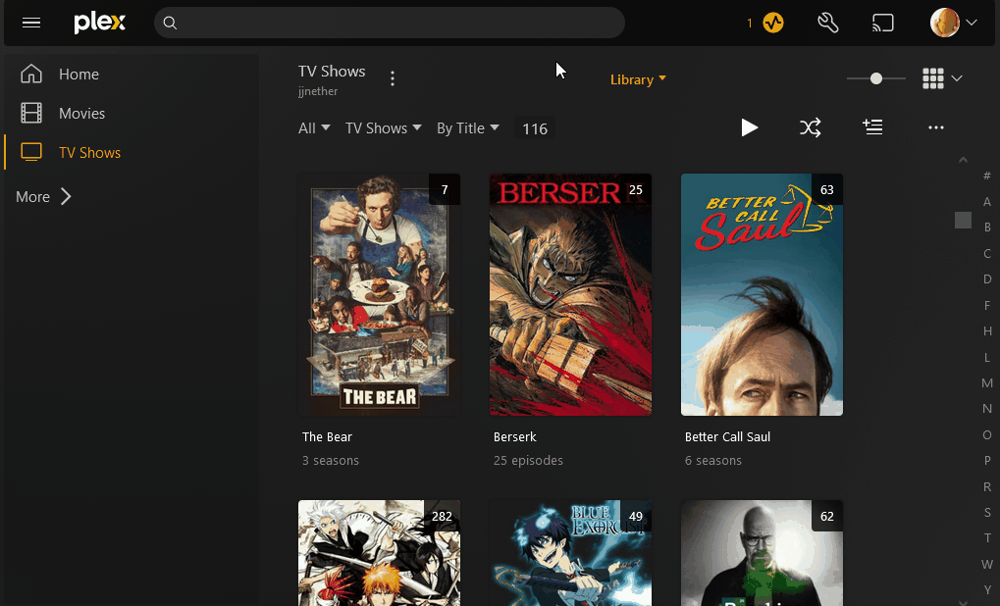
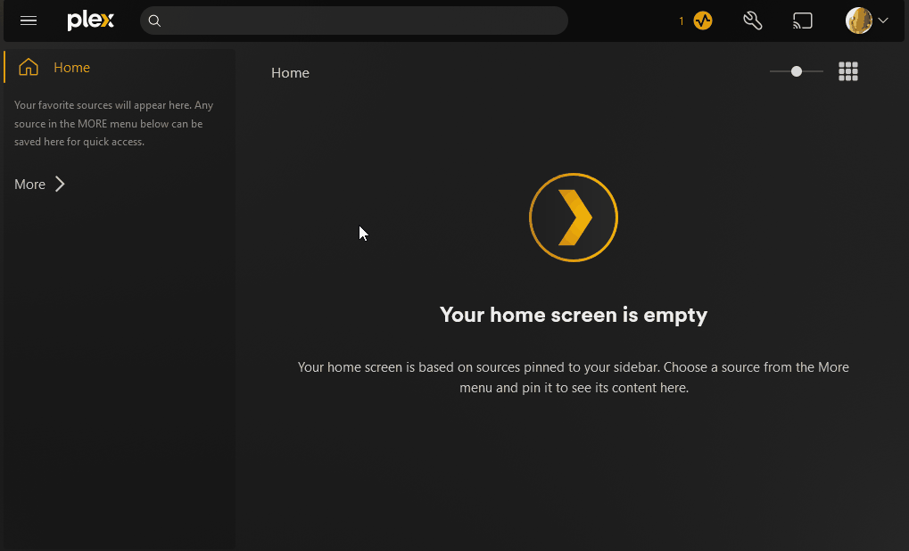
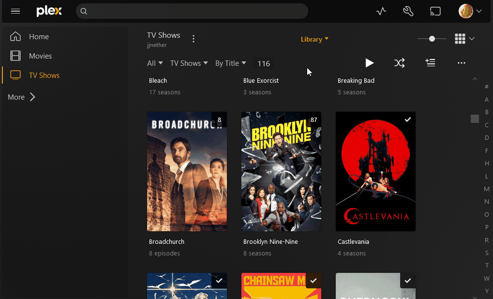

# User Guide for jjnether's Server

The following guide is to help new and existing users have an optimal experience with Plex on this server.

  > [!NOTE]
  > Nothing in this guide is absolutely necessary, but I still recommend you follow it for a better experience

## Account Setup

You should already have a Plex account setup, but this section will walk you through modifying certain account settings:

1. Plex rolled out a feature called [Discover Together](https://forums.plex.tv/t/discover-together-public-release/857227) that I prefer to disable. You can do this by navigating to the `Account` menu and editing settings:

      

        

        
      
       

2. Opt out from sending playback data to Plex by going [here](https://www.plex.tv/about/privacy-legal/privacy-preferences/#opd) and deselecting
  `Send playback data to Plex`:

      

        

        
      
      

3. Hide other users' activity as well as paid Plex content by navigating to the `Online Media Sources` menu in your settings and disabling all options:

      

        

    
      
      

4. You should customize the left side menu of Plex by pinning and reordering libraries:

      

        

    
      
      

5. Movie and TV Show themes can be enabled to play in the background while browsing that media:

      

        

    
      
      

## Playback Experience

1. [This guide](https://mediaclients.wiki/Plex) should be followed for each device you use Plex on. Simply select the device you're setting up and follow the directions.

2. If you use Plex on a computer, I highly recommend using the dedicated Plex application rather than using a web browser (this is due to video codec compatibility).
  The download for the Plex application can be found [here](https://www.plex.tv/media-server-downloads/?cat=plex+desktop&plat=windows#plex-app).

3. If you're experiencing constant buffering, you may need to lower your current quality settings:

      

        
In the media player, navigate to the quality settings and select a quality with a lower bitrate (mbps) than your current selection:

    
      
      

  > On TV's, quality settings are sometimes found by hitting the `HD` button in the corner.

  > The buffering may be due to a poor connection on your end, or due to my poor apartment upload speed

## Requesting Media

1. The primary method of requesting media is by going to the [Overseerr page](https://overseerr.jjnether.com/) and logging in with your Plex account.

2. The alternate method to request media is by using Doplarr in the `plex-peeps` Discord text channel. Simply type one of the following into the chat:

    - /request movie `movie name`

    - /request series `series name`
 
## Notes

- Unless I mark them to keep, movies will be deleted from the server after 3 months of being added. The last month before removal, the movie will be added to a `Leaving Soon` collection on your Plex home.

- Each account can only have 1 stream active at a time. This is due to my apartment having limited upload speed.

- At any time, the Plex server status can be seen below or found at [this link](https://uptime-kuma.jjnether.com/status/plex) (also pinned in the Discord channel)

